2.绝对路径前面的最前面是/root/（右键某一个文件夹，选选择复制文件路径是这样autodl-nas/yoloair/runs/train/exp7没有带root的，所以需要自己手动加上/root/）

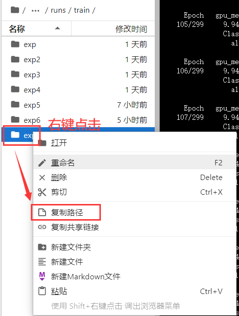

rm -r Attachment2 删除


# 一、上传数据

## 1.1 Xtfp与AutoDL连接

（1）上传or下载数据时，点击无卡模式开机（不一定要是无卡模式哈，只要开机就行）

（2）开机后就获得了：登陆指令、密码


（3）打开Xftp进行连接

假设得到的登陆指令是：`ssh -p 12300 root@rxxxxn-0.autodl.com`

- 用户名：root
- 主机HOST：rxxxxn-0.autodl.com （`@`后的所有内容）
- 端口号：12300
- 密码（最后一行）


（4）新建会话：

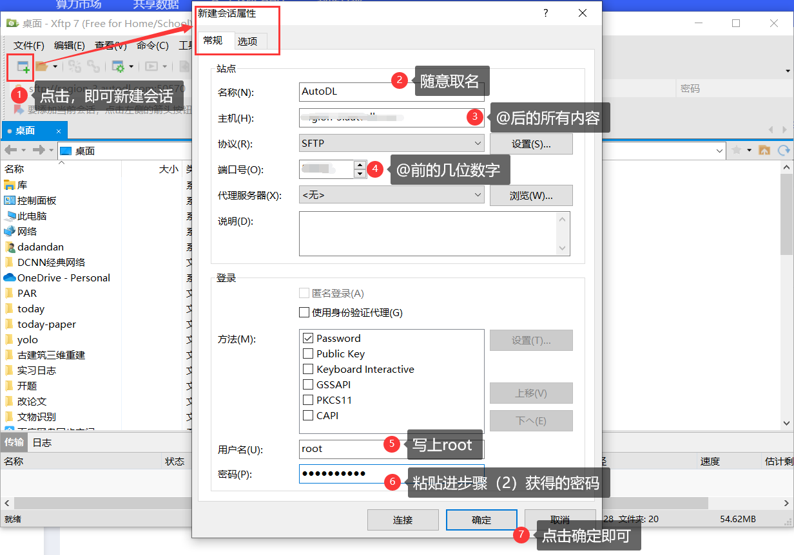


（5）打开已有会话：

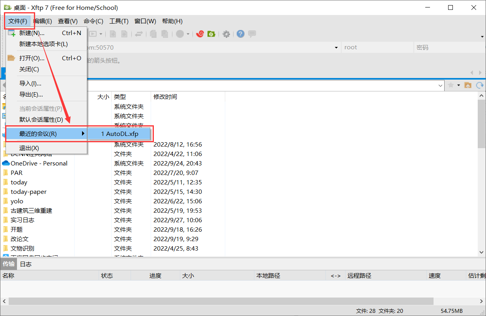

（6）与AutoDL的连接成功界面：

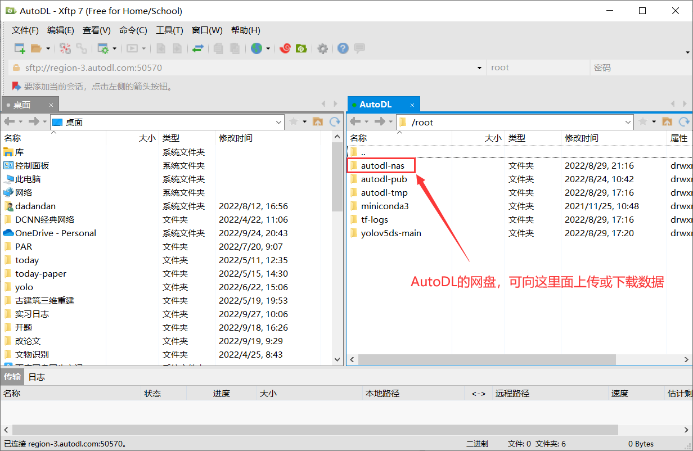

（7）上传镜像到网盘中：


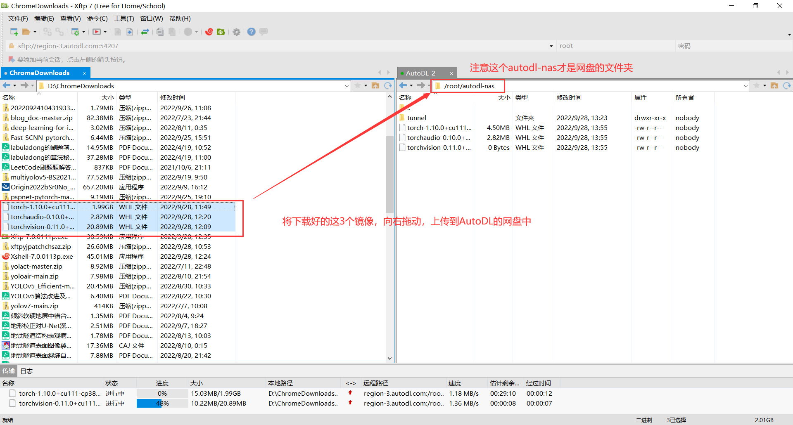

# 二、配置环境

1.点击进入JupyterLab

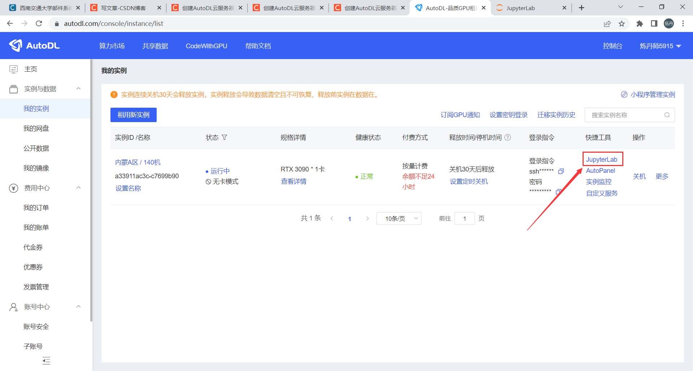

2.进入终端

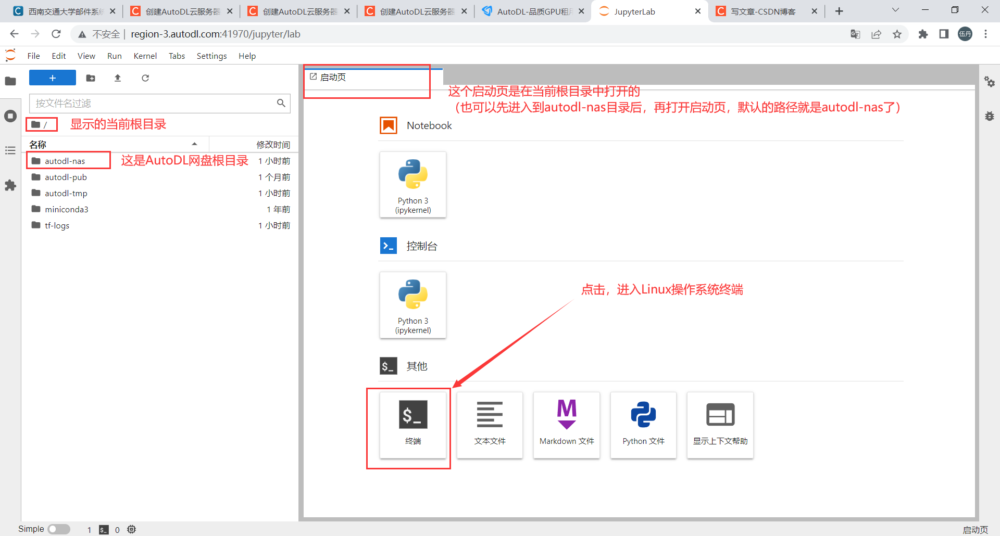

3.编辑文件+刷新，使得能使用conda，以进行后续的环境配置

- 输入：`vim ~/.bashrc`
- 开始进行编辑：输入i
- 移动到文件的最后一行，加上`source /root/miniconda3/etc/profile.d/conda.sh`
- 保存并退出：按Esc键，输入`:wq`，再回车
- 输入bash重启终端（即，刷新一下）

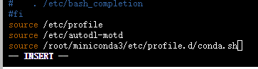

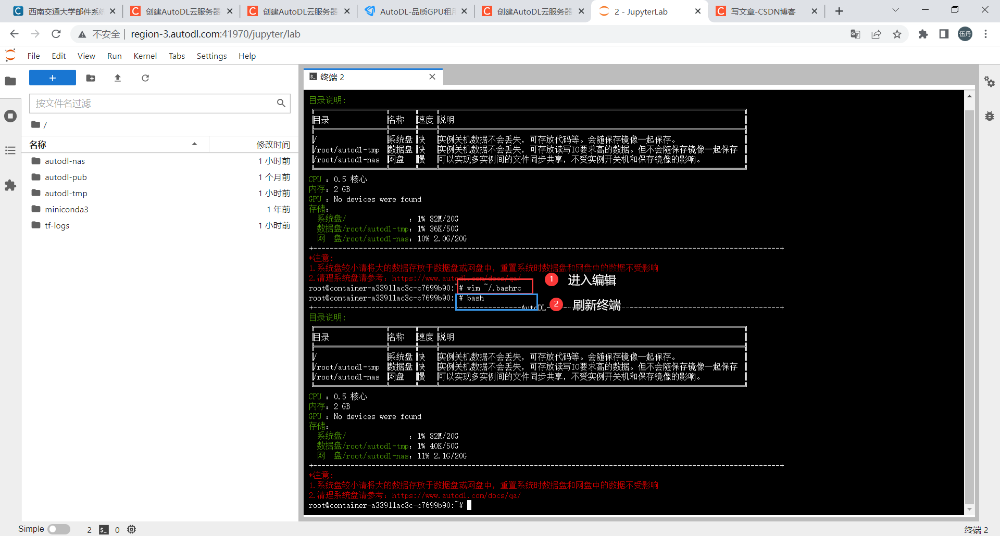

4.

所有torch系列的镜像列表：https://download.pytorch.org/whl/cu111（有时候会卡着，多试几次就能进去了）

找到一个镜像，可以根据自己想要的cuda版本选择：https://mirror.sjtu.edu.cn/pytorch-wheels/?mirror_intel_list

- 进入环境：`conda activate base`
- 创建新环境：`conda create -n py38 python=3.8`
- 进入自创环境，输入：`conda activate py38`
- 安装torch（注意一定要和自己创建实例的环境相对应），切换目录输入命令：pip install torch-1.5.1-cp38-cp38-linux_x86_64.whl（包含cuda版本）

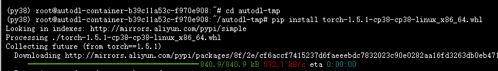

# 三、本地远程连接（PyCharm2021.3专业版）

## 3.1 pycharm专业版激活

### 3.1.1 安装包的下载

### 3.1.2 安装pycharm

选择安装路径，选好后点击 Next 进入下一步

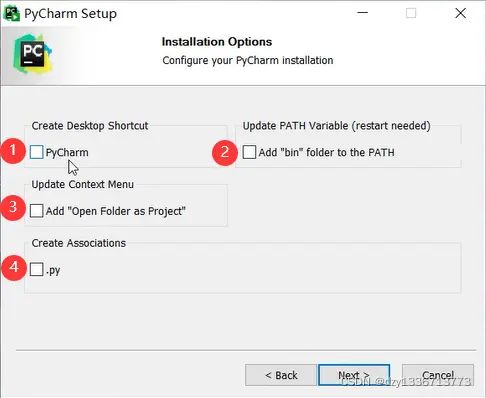

### 3.1.3 开始激活

1.右键快捷方式打开文件所在位置，或直接去 pycharm 的安装路径，找到叫 pycharm64.exe.vmoptions 的文件，以记事本的方式打开

   在该文件最后添加上这样一句话，并保存文件（后面是激活文件存放的路径，自己制定，路径不要出现中文）

    根据自己的系统
       windows:     -javaagent:c:/fineagent.jar
       mac:         -javaagent:/Users/neo/fineagent.jar
       linux:       -javaagent:/home/neo/fineagent.jar

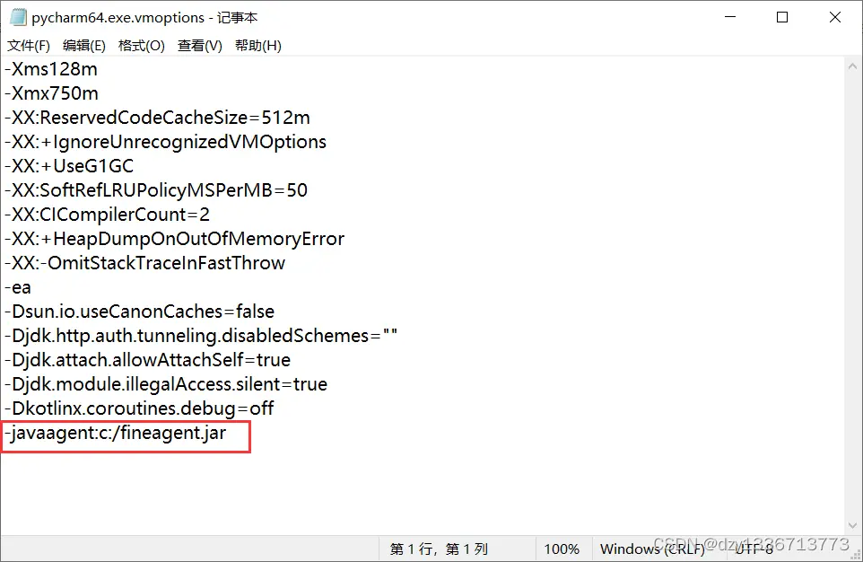

2.之后打开 pycharm，第一次会问是否导入 pycharm 设置，选择下面的不导入，然后点击OK 

  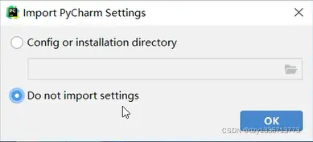

3.弹出激活界面，选择用readme.txt文件的激活码激活，然后将下面的激活码复制进去点击 Activate 激活完毕。

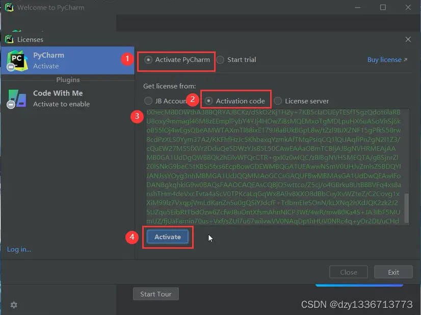

作者：刻风风云 https://www.bilibili.com/read/cv15766138/ 出处：bilibili

## 3.2 Pycharm远程连接AutoDL

1、无卡模式开机，获取登录指令

2、打开Pycharm，选择Add Project Interpreter

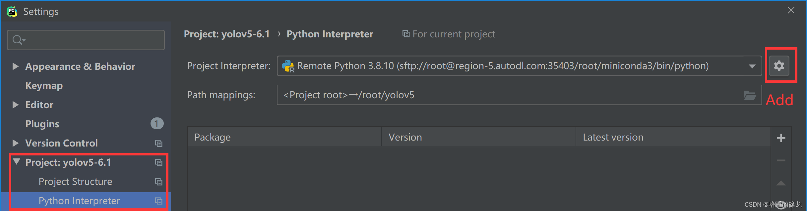

3、选择SSH解释器，输入登录指令

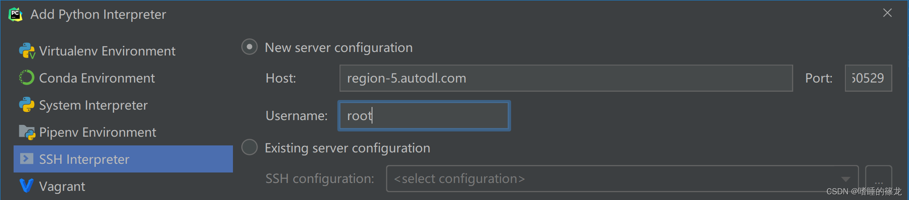

4、输入密码

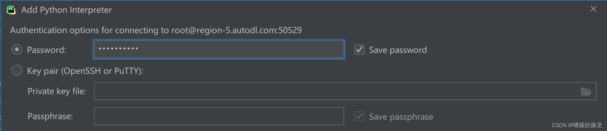

5、选择Python解释器：/root/miniconda3/bin/python，同时同步本地文件夹和远程服务器的文件夹，由于这里勾选了Automatically upload project files to the server，因此默认本地的工程文件已经全部更新到了对应的远程服务器的文件夹中

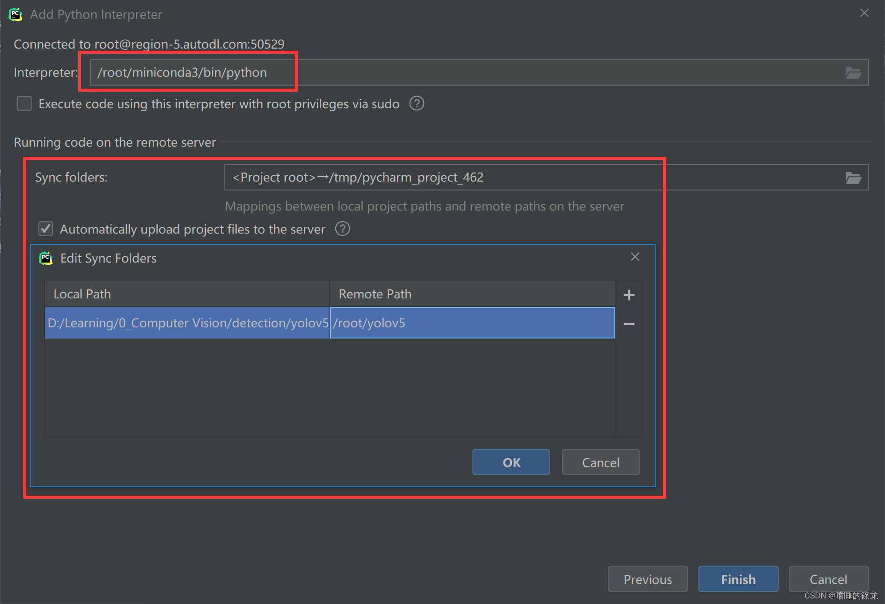


之后再整理下，看看能不能直接在terminal打开服务器终端，还是说执行之后的操作才能打开的
1、进入远程服务器终端命令窗口，并更新bashrc中的环境变量：conda init bash && source /root/.bashrc

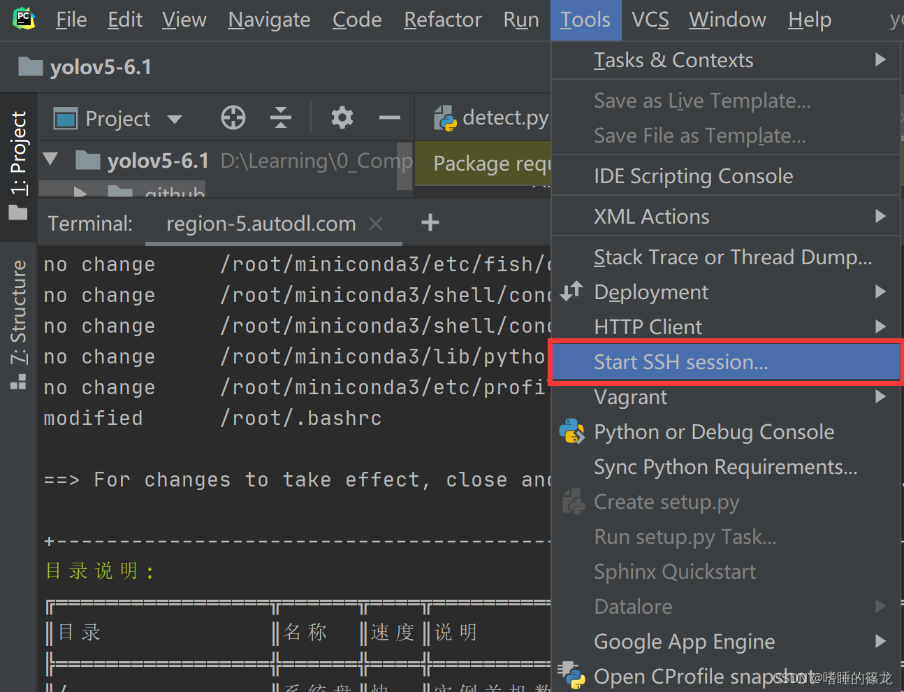

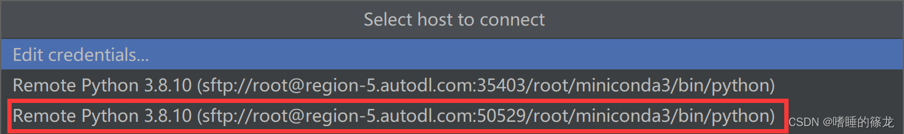

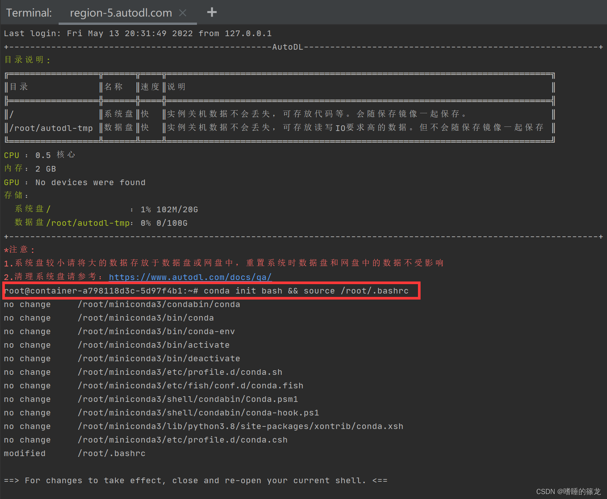

3、新建环境（可选，也可以直接在base环境安装依赖）

```
$ conda create -n yolo python=3.8    
$ conda init bash && source /root/.bashrc  (非常重要)
$ conda activate yolo
```

4、安装pytorch、torchvision和cudatoolkit，根据镜像安装对应版本

```
$ conda install pytorch==1.10.0 torchvision==0.11.0 torchaudio==0.10.0 cudatoolkit=11.3 -c pytorch -c conda-forge
```

5、安装默认依赖

```
$ pip install -r requirements.txt  
```

————————————————
版权声明：本文为CSDN博主「嗜睡的篠龙」的原创文章，遵循CC 4.0 BY-SA版权协议，转载请附上原文出处链接及本声明。
原文链接：https://blog.csdn.net/weixin_43799388/article/details/124759054


看看有没有底下这个必要

Tools -> Deployment -> Configuration

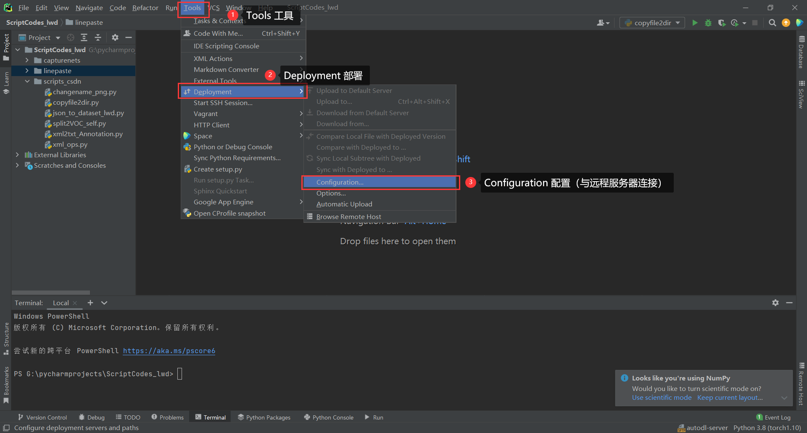

添加SFTP

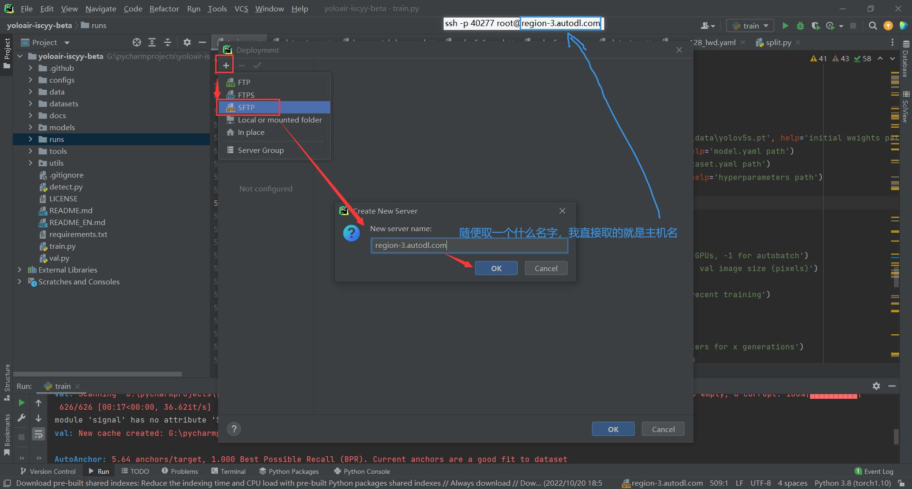

点击...进入SSH Configurations

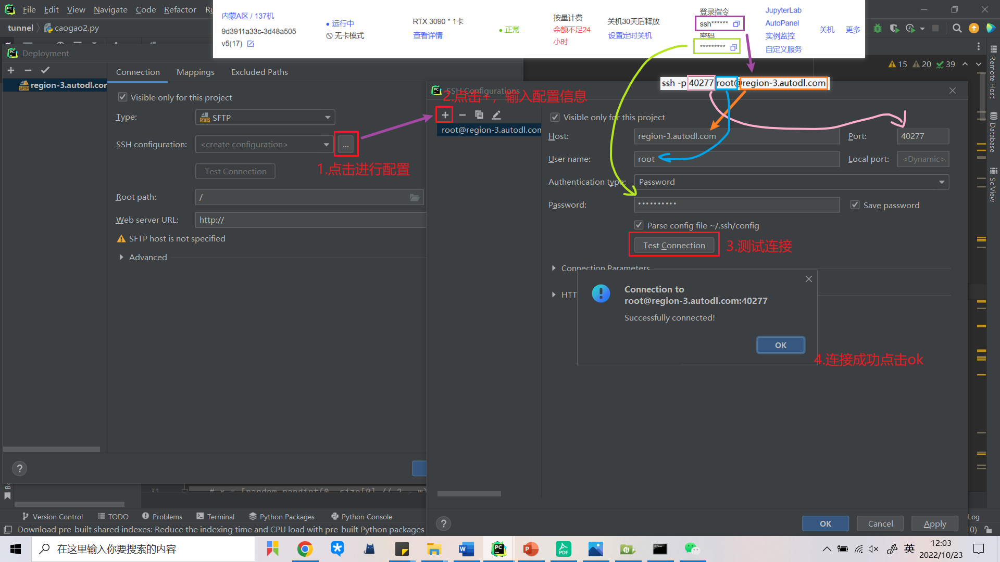 

完成配置

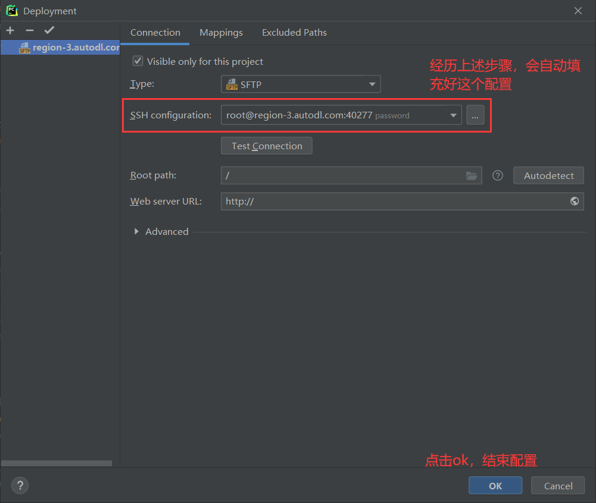


连接到远程终端

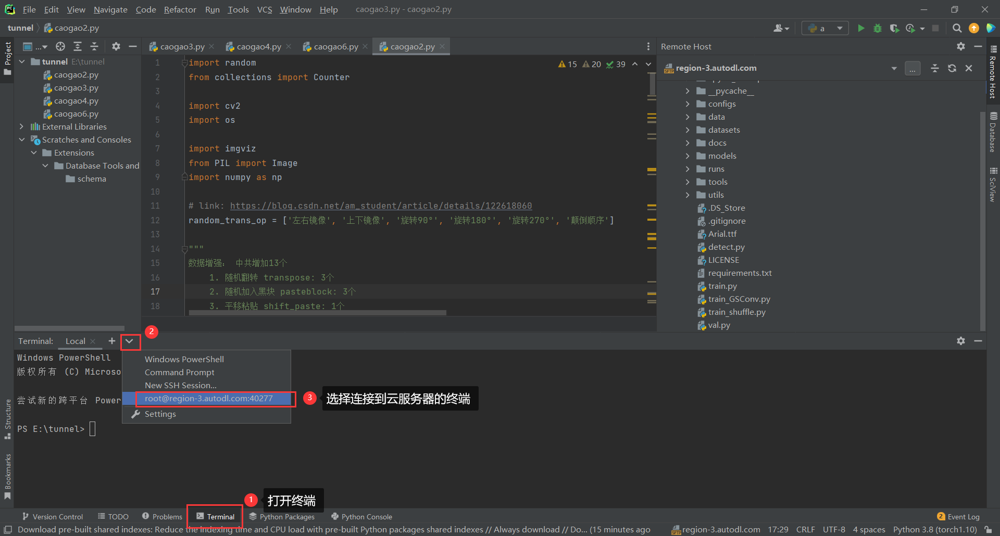


查看代码内容，并重新上传更新代码

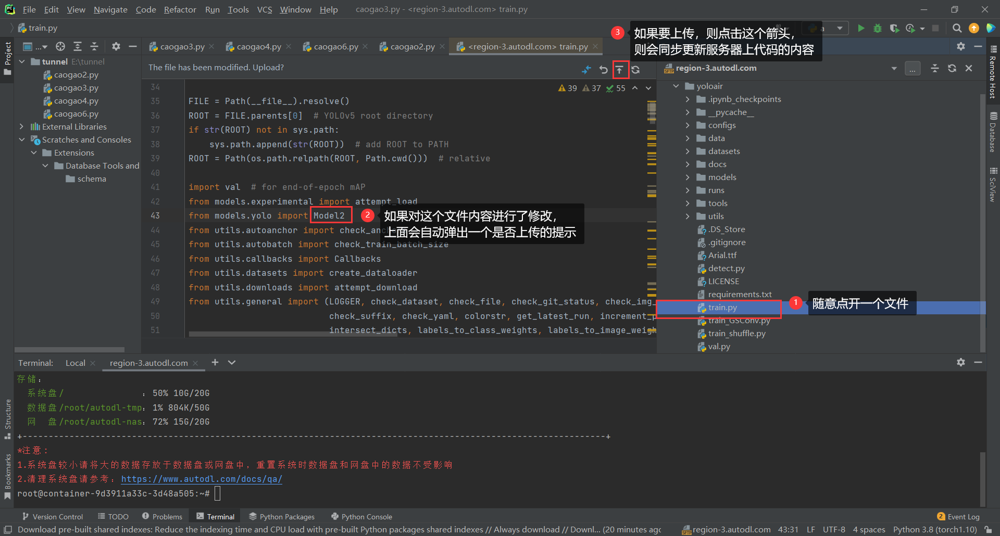

运行代码

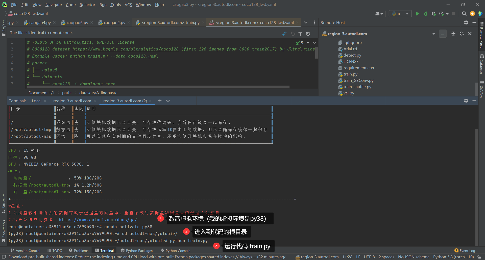

————————————————
版权声明：本文为CSDN博主「孟孟单单」的原创文章，遵循CC 4.0 BY-SA版权协议，转载请附上原文出处链接及本声明。
原文链接：https://blog.csdn.net/LWD19981223/article/details/127085811


### 训练技巧

1、最简单的方式是通过jupyterlab的终端来执行，只要jupyterlab不出现重启（几乎不会），jupyterlab的终端就会一直运行，无论是本地主机断网还是关机。如果关闭了这个终端tab，可以在左侧栏`正在运行终端和内核`中找回。

2.自动关机
不确定自己的代码需要执行多久结束，希望执行完成后立马关机，这类场景可以通过shutdown命令来解决。

1、命令行后面加shutdown

```
$ python train.py              # 原执行命令
$ python train.py; shutdown    # 用;拼接意味着前边的指令不管执行成功与否，都会执行shutdown命令
$ python train.py && shutdown  # 用&&拼接表示前边的命令执行成功后才会执行shutdown
```


2、在Python代码中执行shutdown命令

```python
import os

if __name__ == "__main__":
    ...........
    os.system("shutdown")
```