cuda版本的pytorch安装,提前安好visual studio，避免系统底层出现编译错误

# 一、cuda下载

## 1、查看CUDA支持版本

打开NVIDIA控制面板，按照图示顺序查看CUDA所支持的最高版本

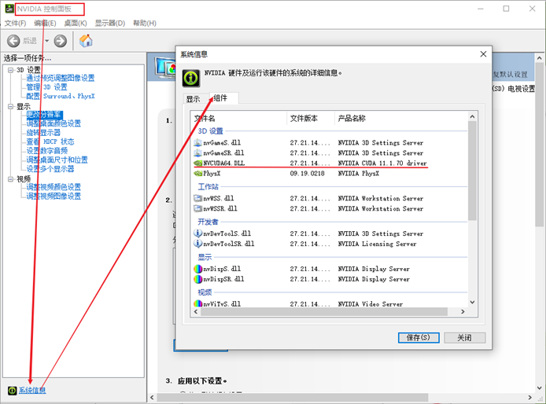

## 2、下载CUDA

打开网址：https://developer.nvidia.com/cuda-toolkit-archive，最好选择和自己电脑刚好匹配的版本，实在不行再往低了选

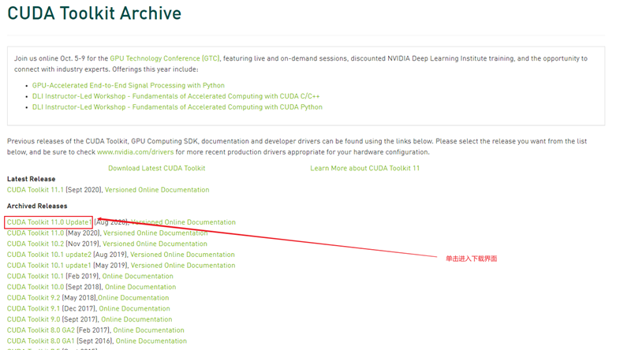

此时要根据自己的系统进行选择

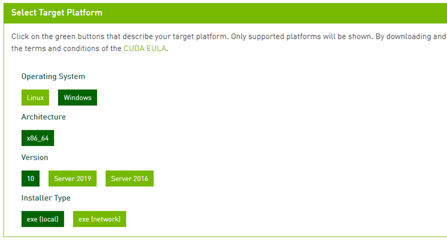

## 3、下载cuDNN

打开网址：https://developer.nvidia.com/cudnn，点击Download cuDNN

# 二、cuda安装

## 1、安装CUDA

双击安装包开始安装，此时让你选择的路径并不是安装路径，而是暂时解压出来的文件所需要存放的地方，安装完成后会删除，只要保证选择空间足够大的地方即可，安装路径是默认C盘里，不能修改，此处可以不更改，点击OK即可

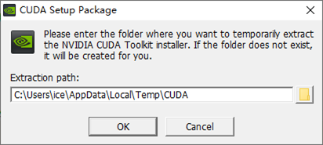

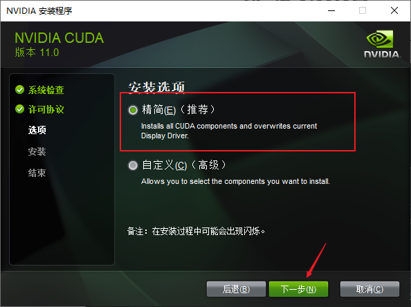


验证CUDA是否安装成功，打开cmd，输入 `nvcc –V`，如下返回则说明安装成功

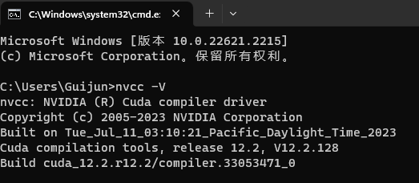

## 2、安装cuDNN

(1)打开cuda安装文件夹，默认的强制安装路径为：

`C:\Program Files\NVIDIA GPU Computing Toolkit\CUDA\版本号`

打开安装路径如下：

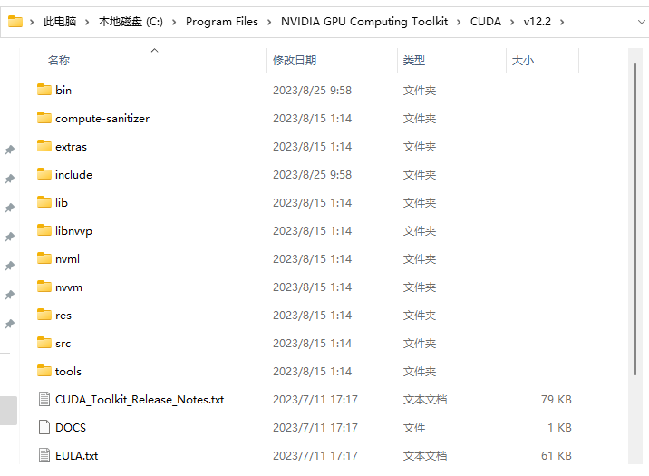

(2)将解压的cuDNN压缩包内的三个文件夹复制到CUDA安装目录下：

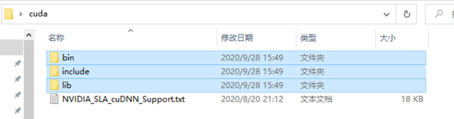


(3)验证cuDNN是否安装完成，

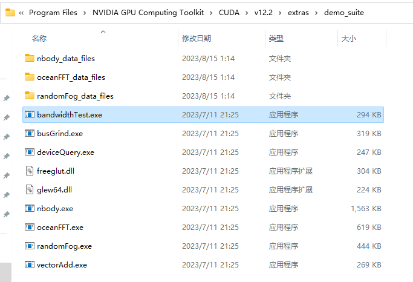

打开cmd，输入`cd C:\Program Files\NVIDIA GPU Computing Toolkit\CUDA\v12.2\extras\demo_suite`

然后执行命令：`bandwidthTest.exe`

然后再执行命令：`deviceQuery.exe`

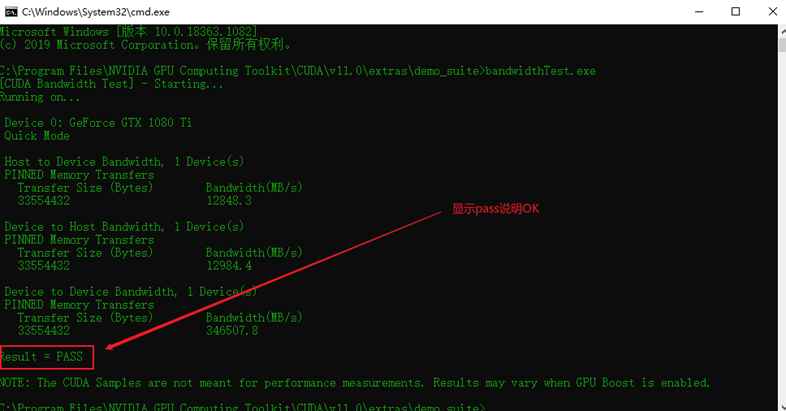

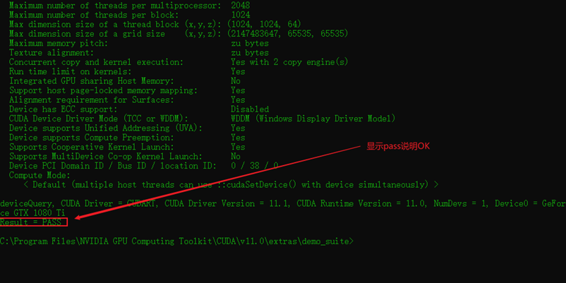

# 三、下载PyTorch安装文件

打开网址：https://download.pytorch.org/whl/torch_stable.html，

每个文件命名都是有规律的：

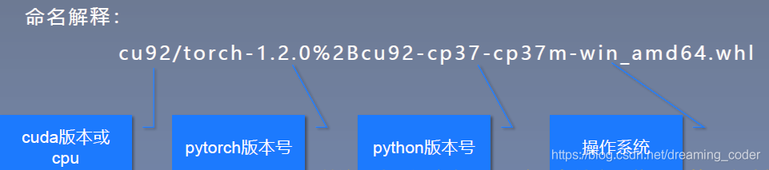

使用快捷键Ctrl+F，搜索我们需要安装的版本文件下载

# 四、安装pytorch

1、打开PyCharm，打开Terminal窗口：

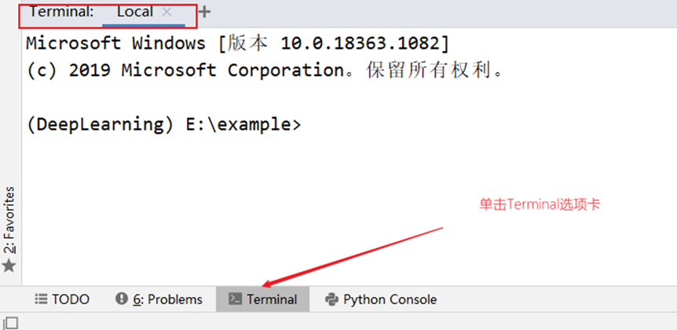

2、在PyCharm的Terminal窗口中键入cd 命令，切换目录到PyTorch安装包所在的地址，然后分别执行pip install命令安装两个文件，先安装torch，再安装torchvision，期间会一起下载所需要的依赖包

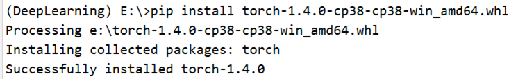

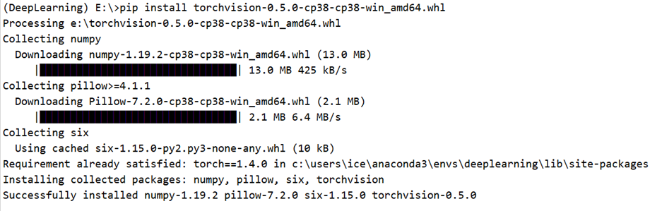

3、现在验证是否安装成功，在main.py里写入以下代码并运行：

```python
import torch
import torchvision

print(torch.__version__)
print(torch.version.cuda)

print(torchvision.__version__)
```

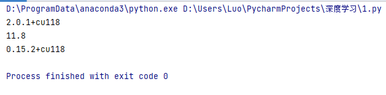

