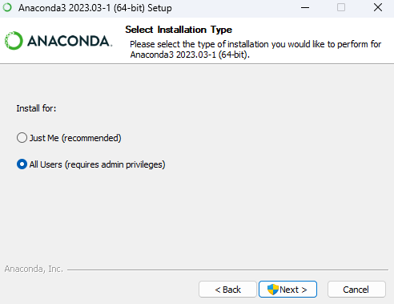
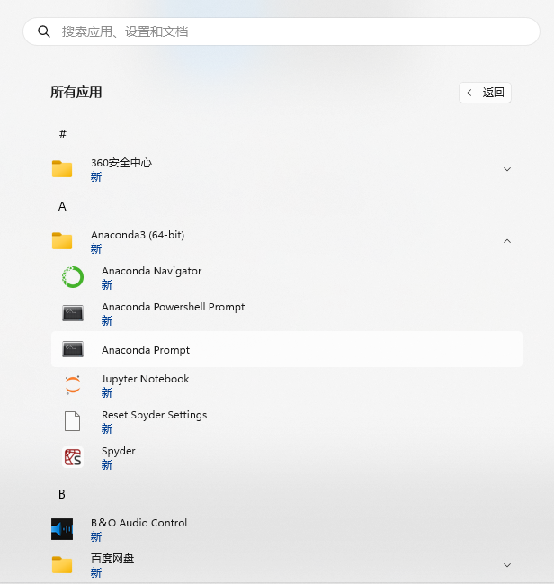
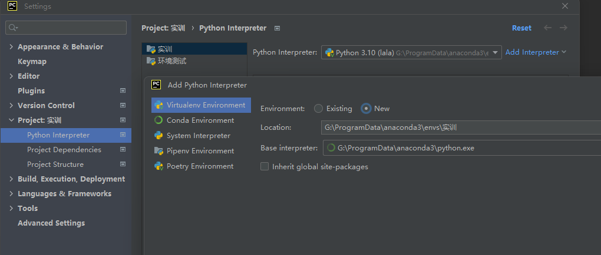
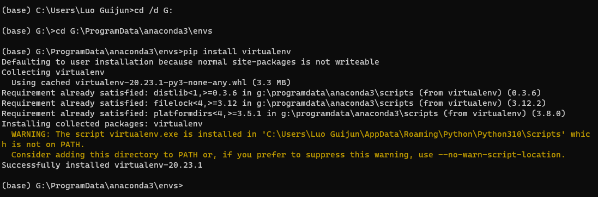
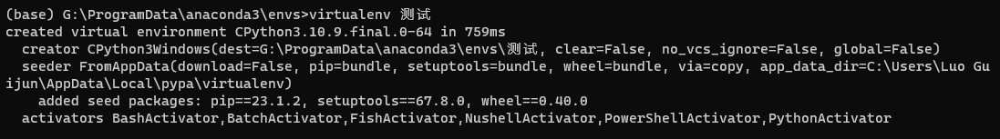
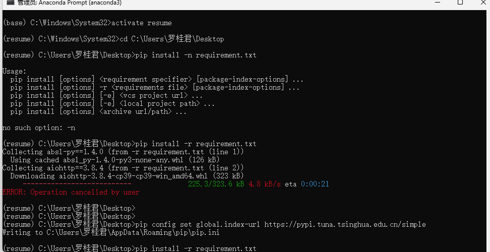

# 一、Anaconda安装

下载地址：https://www.anaconda.com/download/
百度网盘链接：https://pan.baidu.com/s/1ccqr833QKsxI5qkW97LCJg

提取码：o09u


选All Users 点Next



接下来选择安装路径，这里不建议装在C盘，安装完大概3个G左右，现在都是固态硬盘了，安装到固态硬盘就好，路径要知道自己安到了哪里（后续使用不同环境的时候会用到这个安装路径）。选择好了之后点击Next

安装好后修改下载源路径



1.修改为清华源
打开anaconda prompt输入

```
config --add channels https://mirrors.tuna.tsinghua.edu.cn/anaconda/pkgs/free/
conda config --add channels https://mirrors.tuna.tsinghua.edu.cn/anaconda/pkgs/main/
conda config --add channels https://mirrors.tuna.tsinghua.edu.cn/anaconda/cloud//pytorch/
conda config --add channels https://mirrors.tuna.tsinghua.edu.cn/anaconda/cloud/conda-forge/
conda config --set show_channel_urls yes  //从channel中安装包时显示channel的url
```

2.移除清华源

```
config --remove channels https://mirrors.tuna.tsinghua.edu.cn/anaconda/cloud/conda-forge/
```


这个命令是为了移除之前`conda config --show channels`显示的清华源。

# 二、创建虚拟环境

## 1.首选pycharm创建



## 2.手动创建特别麻烦

出现某个目录拒绝访问时，考虑文件权限的问题。

anaconda prompt输入：`pip install virtualenv`



出现安到其他地方了，就按照提示将那个位置路径添加到环境变量中。出现没有哪个包就装哪个包，也别乱改位置了，太麻烦了。

`virtualenv  XX` 创建环境



# 三、根据requirement.txt安装扩展库

激活环境：`activate XX`

切换到需求文件所在位置，`pip install -r "文件名"`




