# 1.准备工具：电脑、网络、u盘（至少8g）

**大体步骤**：先在官网下载win11安装包到u盘内，然后在需要重装的电脑上进入u盘内的系统就可以进入重装界面了

# 2.win11安装包

浏览器搜索“Download Windows 11“或者进入以下网页

[Download Windows 11 (microsoft.com)www.microsoft.com/zh-cn/software-download/windows11](https://link.zhihu.com/?target=https%3A//www.microsoft.com/zh-cn/software-download/windows11)

**步骤：**

无脑下一步就可

接受然后下一步

一直下一步就好了

这里选择u盘然后下一步

到这里，我们插上u盘，然后在这里选中u盘，点击下一步，就开始制作启动盘了

到这里，我们的系统盘就做好了

# 3.重启电脑装上系统

要先把u盘插到要重装系统的电脑上，然后进入启动项选择。

这个启动项我们可以在浏览器搜索一下怎么进入，以联想电脑为例进入启动项是f12键

在按下开机键之后疯狂点击f12，就可以成功进入启动项选择，选择uefi模式的u盘

注意嗷，这里的legacy是传统模式，uefi是快速模式，我们用uefi启动就好

接下来的每一个过程我都直接拍照下来，大家按照我的来就好

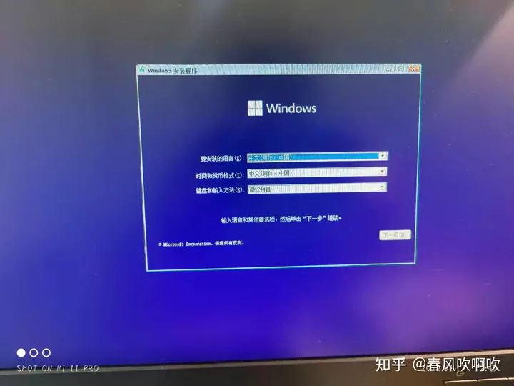

这里不用管，下一步

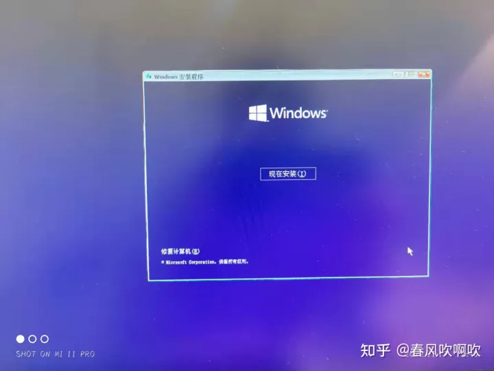

现在安装

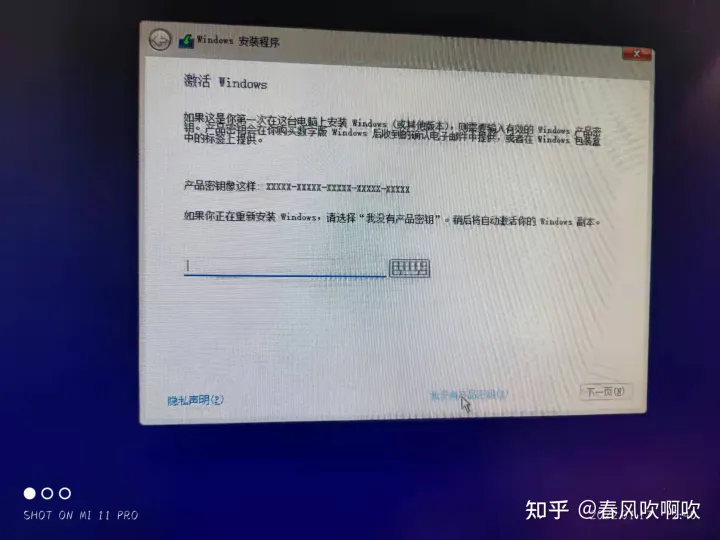

这里选择我没有产品密钥

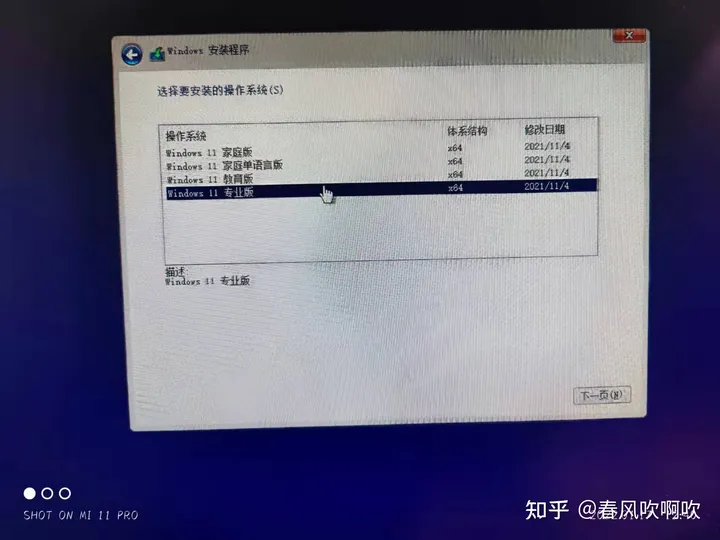

这里选择专业版

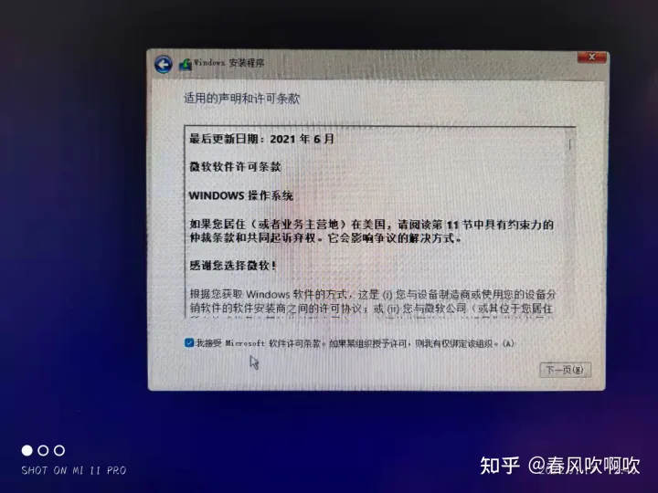

这里选择我接受然后下一步

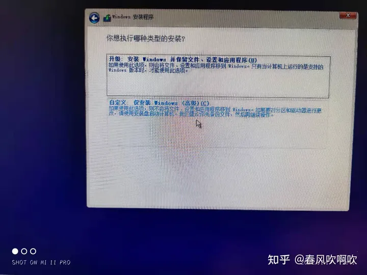

这里选择自定义

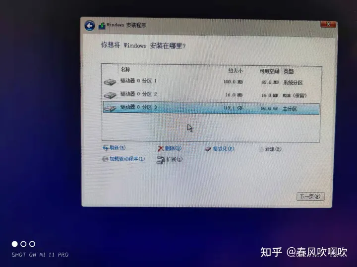

这里稍微麻烦点了，我们需要把所有的驱动器都删除掉，然后他就会合并成一个未分配的驱动器，我们再新建一下，就会自动生成新的分区，可能会一下产生好几个，我们选最大的那个就行了

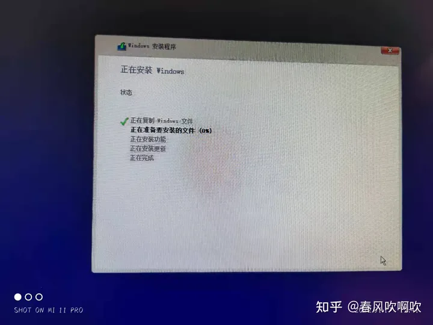

到这里就可以等待了

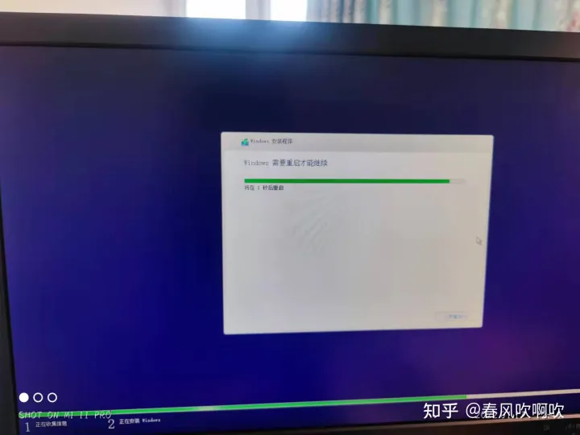

我们在看到这里显示需要重启才能继续的时候，赶紧把u盘拔下来，否则就会继续进入u盘系统继续装系统了，就会出现同时装了好几个系统的情况

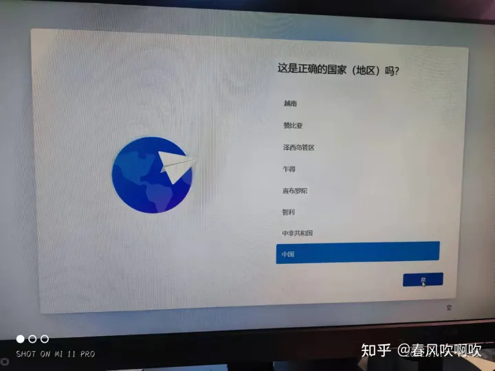

可能会碰到需要强制联网，按下shift+f10,输入OOBE\BYPASSNRO

等待系统重启，再次进入会出现【我没有Internet连接】

# 4.激活系统

[激活工具下载](https://pan.baidu.com/link/zhihu/7ZhlzMuThPiWRzFG5mVSZxRjNqb3IkVwZQVG==)

- 直接点击开始即可

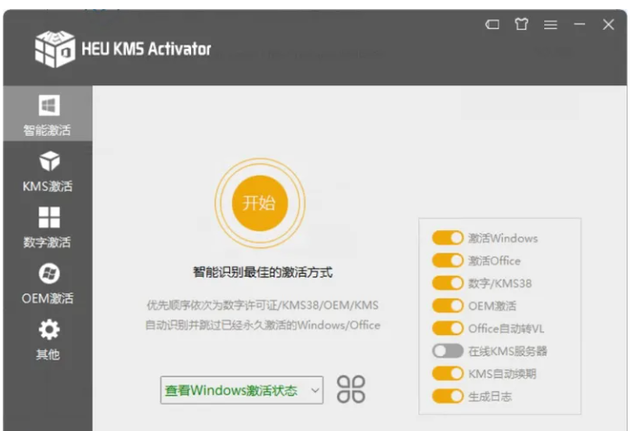

- 添加桌面图标

